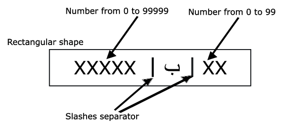

# Moroccan License Plate OCR for Drone Traffic Monitoring (YOLOv8)

This project implements an **automated traffic enforcement system** for **Moroccan license plates** using drone footage and the YOLOv8 object detection framework. The system detects vehicles, tracks their movement, calculates speeds, and performs OCR on license plates of speeding vehicles.

## 📌 Features

- **Drone footage processing** for traffic monitoring from aerial perspective
- **Multi-stage YOLOv8 detection** for:
  - Vehicle detection and classification
  - License plate localization
  - Individual character segmentation
- **Real-time vehicle tracking** with ByteTrack
- **Speed calculation** using pixel-based distance measurement across frames
- **Automated speed enforcement** - OCR only triggered for speeding vehicles
- **Custom character set** trained for Moroccan plates
  <br><br>
  
  <br><br>
- **Comprehensive logging** of violations with timestamps and coordinates
- Outputs annotated footage with speed readings and plate recognition

## 🛠 Installation

### 1️⃣ Clone the repository

```bash
git clone https://github.com/Haytham-Ziani/OCR-Project/
cd OCR-Project
```

2️⃣ Create and activate a conda environment

```bash
# Create a new conda environment
conda create -n <env-name> python=3.9 -y

# Activate the environment
conda activate <env-name>
```

### 3️⃣ Install dependencies

```bash
pip install -r requirements.txt

# If any module not found errors arise, please install them using: pip install <module-name>
# If you don't have a GPU, you must change the torch line to the CPU version: torch==2.7.1+cpu
```

#### *Make sure to create the following directories: results, data, models.*

## 📊 Dataset

The system uses multiple datasets for different detection stages:

### Vehicle Detection Dataset: VisDrone Dataset
- **Content**: Aerial images containing vehicles in diverse environments.
- **Vehicle types**: Cars, trucks, motorcycles, buses
- **Annotations**: Bounding boxes with vehicle classification

### License Plate Dataset
- **Moroccan license plate images** from various angles and lighting conditions
- **Annotations**: Plate-level bounding boxes
- 5000+ images with bounding boxes annotations

### Character Recognition Dataset
- **UM6P Open Data Moroccan License Plate Dataset**: [Character Recognition Dataset](https://cc.um6p.ma/cc_datasets) (in case link broken use kaggle)
- **Scale:** ~800 unique pictures of Moroccan vehicle plates
- **Purpose:** Designed specifically for OCR applications on Moroccan license plates
- Individual character segmentation 
- **Class mapping:**

0-9 → Digits<br>
10 → Alif (أ)<br>
11 → Baa (ب)<br>
12 → Waw (و)<br>
13 → Dal (د)<br>
14 → Haa (هـ)<br>
15 → W (New Cars)<br>

## 🧠 Models
This project uses multiple YOLOv8 models, each trained locally on an RTX 3050 Laptop GPU (6GB VRAM):

### Vehicle Detection Model

- Architecture: YOLOv8s
- Dataset: VisDrone Dataset
- Classes: Car, truck, motorcycle, bus, van
- Performance: mAP@0.5 = 0.76 

### License Plate Detection Model

- Architecture: YOLOv8n
- Dataset: Custom Moroccan license plate dataset
- Classes: License plate
- Performance: 0.90 Precision. Focused only on detecting regular LPs, ommitting special ones like diplomatic, police, etc.


### Character Detection Model

- Architecture: YOLOv8n
- Dataset: UM6P Open Data (~800 images)
- Classes: Digits (0–9), Arabic characters (أ, ب, د, هـ, ت, و)
- Performance: 0.973 Precision and Recall
- Training Time: less than 1 hour, small dataset


### Training Configuration:

- Epochs: ~50 for each model
- Batch Size: 16 (limited by 6GB VRAM)
- Image Size: 640x640
- Learning Rate: 0.01 initial
  <br><br>

  **All the models can be found here: [Models](https://huggingface.co/Haytham-Ziani/OCR_Project/tree/main)**
  <br><br>
  *Make sure to create models directory, download the pt files and store them there*

## 🚀 Usage

### Process drone footage for traffic monitoring - Full pipeline with violation logging


```bash
python main.py --config configs/pipeline_config.yaml --input <path_to_input> --output <path_to_output>

Example: python main.py --config configs/pipeline_config.yaml --input data/video_input.mp4 --output results/video_output.mp4
```


## 🖼 Example Results (TO BE EDITED AFTER TESTING AND DEBUGGING!!)


| Drone Footage | Vehicle Detection | Speed Tracking | License Plate OCR |
|:-------------:|:-----------------:|:--------------:|:-----------------:|
|  |  |  |  |

### Sample Output Log (JSON File)
(TO BE EDITED AFTER TESTING AND DEBUGGING!!)
```
{
  "violation_id": "5ae85e22",
  "timestamp": "1970-01-01T00:00:17.640000",
  "track_id": 111,
  "speed": 110.93,
  "speed_threshold": 100,
  "license_plate": "123456-ب-17",
  "plate_confidence": 0.786,
  "bbox": [
    569,
    501,
    734,
    648
  ],
  "image_path": "results/annotated_frames/violation_19700101_000017_5ae85e22.jpg",
  "frame_number": 441
}
```


```
[2024-01-15 14:30:25] VIOLATION DETECTED
Vehicle ID: 47
Speed: 95 km/h (Limit: 80 km/h)
License Plate: 123456-ب-17
Location: (lat: 33.5731, lon: -7.5898)
Confidence: 0.94
Evidence: saved to ./violations/20240115_143025_vehicle47/
```

